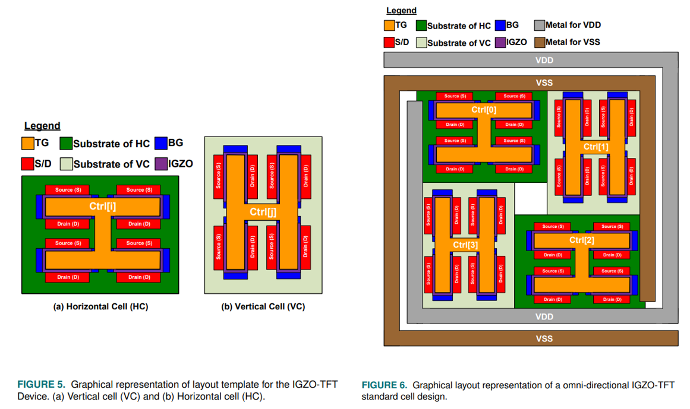
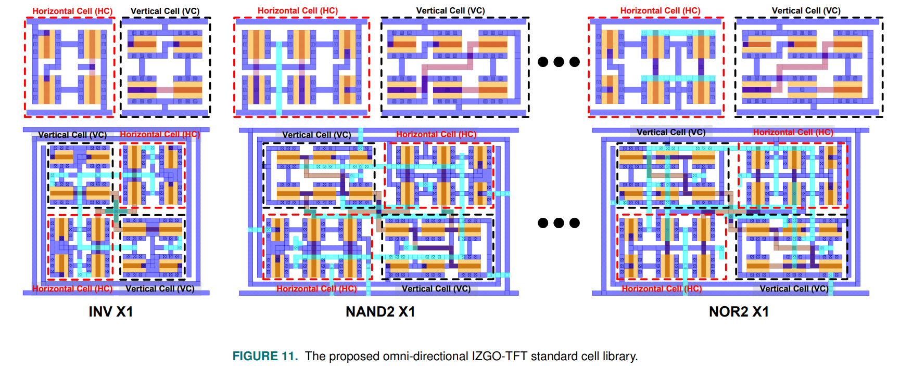

# Thin-Film Flexible Electronics Design Kit, Standard Cell and Design Methodology - IGZO-TFT-PDK

This repository introduces an open-source platform for GaZnO (IGZO) TFT technology process. To solve the tensile force-induced current variation problem in IGZO-TFT devices, an omni-directional device and its layout template with a compensation methodology that mitigates its variation are proposed, published in [this paper](https://ieeexplore.ieee.org/document/9626163).
<!-- TABLE OF CONTENTS -->
## Table of Contents

* [IGZO-TFT-PDK](#IGZO-TFT-PDK)
  * [Tech File](#TechFile)
  * [LEF format](#Lef)
  * [GDS format](#Gds)
  * [Scripts](#Scripts)
* [Author](#Author)
* [License](#License)

## IGZO-TFT-PDK

The proposed IGZO-TFT PDK provides design files in GDS and LEF format, a series of scripts, and physical verification files which are commonly used in commercial EDA tools like Cadence Innovus, Virtuoso, and Mentor Calibre.
```
git clone https://github.com/SJTU-YONGFU-RESEARCH-GRP/IGZO-TFT-PDK/
```

## Tech File

The technical file, `TFT_tech.tf`, provides information on the required techniques for the physical implementation of the IGZO TFT design.

## LEF Format

We support three lef format design files that are `omni_directional_tech.lef`, `omni_directional_sc_single.lef` and `omni_directional_sc.lef`. `omni_directional_tech.lef` is the technical LEF file that contains the process information of omni-directional IGZO-TFT devices. `omni_directional_sc_single.lef` and `omni_directional_sc.lef` are the cell library LEF files containing the uni-directional (horizontal or vertical), omni-directional macro and standard cell information required for the design, respectively.



## GDS Format

We provide 3 omnidirectional IGZO-TFT designs in gds format as examples, including `INV_1`, `NAND2_1` and `NOR2_1`.



## Scripts

To initial our proposed IGZO-TFT-PDK, we provide a script file as reference. Or you can go into your design path, start innovous, and type commands: 
```
set init_gnd_net VSS
set init_lef_file {omni_directional_tech.lef omni_directional_sc_single.lef omni_directional_sc.lef}
set init_pwr_net VDD
set init_verilog ${verilog_file}
init_design
```

## Authors

* **Ce Ma** 
* **Qing Zhang**
* **Yuxin Ji**
* **Lining Hu**
* **Yaxin Liu**
* **Kaiquan Chen**
* **Jian Zhao**
* **Yongfu Li***

## License

Please cite these papers if you have used part of this work.
```
C. Ma, et al., "IGZO-TFT-PDK: Thin-Film Flexible Electronics Design Kit, Standard Cell and Design Methodology," in IEEE Open Journal of Circuits and Systems, vol. 2, pp. 757-765, 2021, doi: 10.1109/OJCAS.2021.3123396.
```
